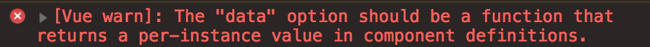

```
export default {
  // 이 안의 내용은 모두 Vue Instance 에 포함되어 생성된다.
  // "data는 반드시 함수다."
  data: () => ({
    name: 'hesung yoon',
   })
}
```
-   만약 data: { name: 'hesung'} 하면, 콘솔에서 경고가 나온다.

- 왜냐하면 vue 컴포넌트 안에 data는 반드시 함수로 쓰여야 한다.
- declare your data properties as functions, otherwise they are not going to be reactive.
```
data: function() {
  return {
    name: ''
  }
}
```
```
// 위에 함수를 메소드 축약 표현으로
enhanced object prototype (메소드 축약 표현)
data() {
  return {id: 1,
          name: 'hesung yoon',
          phone: '1234'}
}
```
```
// arrow function 이 제일 간결
// () => { return { a: 1 }; }
// () => ({ a: 1 }) // 위에랑 똑같음
data: () => ({
  id:1,
  name: 'hesung yoon',
  phone: '1234'
})
```
